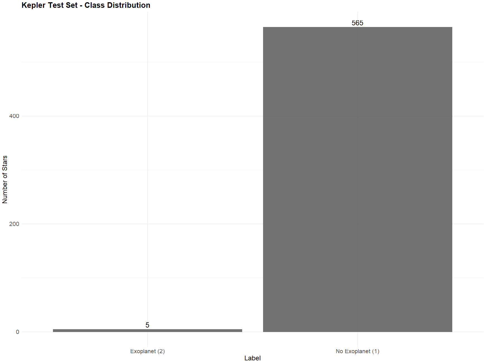

# Exoplanet Transit Detection Using Time Series Analysis

A time series case-control study detecting planetary transit signatures in Kepler mission stellar light curves. The project pairs ARIMA modeling of detrended, log-transformed flux with Fourier harmonic regression featuring AIC-selected harmonic counts, plus robust dip detection (rolling median ± k·MAD) on raw flux. Four stars are analyzed—two confirmed exoplanet hosts (LABEL = 2) and two non-hosting controls (LABEL = 1)—drawn from the Kepler labelled time series dataset.

---

## Key Findings

- **Robust thresholds outperform classical ones for transit hunting.** The deep negative outliers of genuine transits inflate the standard deviation, pushing a mean−3·SD threshold away from the very events being hunted; a median−k·MAD threshold on locally detrended flux resists this self-contamination.

- **The two pipelines deliberately see different versions of the signal.** ARIMA operates on detrended, log-transformed flux (stochastic autocorrelation structure), while dip detection runs on the *raw* flux—a design choice acknowledging that the 25-point rolling mean partially absorbs short transits.

- **Confirmed hosts flagged more transit candidates than controls:** 1 and 3 events for the two host stars versus none for the non-hosting stars under the robust MAD threshold—suggestive, not confirmatory, with n = 4 and no significance testing applied.

- **Spectrally estimated periods aligned with plausible orbital timescales** for the hosting stars ([P1] and [P2] observation indices), while control stars displayed fewer and weaker periodic signatures.

- **Ljung-Box diagnostics corrected for fitted ARMA orders** (fitdf = p + q), avoiding the anticonservative p-values raw-residual Box tests produce—residual whiteness was assessed at p ≥ [MIN_P] across all four stars.

---

## Visual Results



*Figure 1: Class distribution of the Kepler test set, showing the pronounced imbalance between non-hosting stars (LABEL = 1) and confirmed exoplanet hosts (LABEL = 2).*

<br>


*Figure 2: Original light curves for the four selected stars—two confirmed exoplanet hosts (top) and two non-hosting controls (bottom).*

<br>


*Figure 3: Robust dip detection on raw flux (rolling median + MAD threshold). Red shaded bands mark flagged events with a red dot at each event midpoint; the dashed line shows the detection threshold.*

<br>


*Figure 4: Fourier harmonic regression fits (AIC-selected K) overlaid on detrended flux for all four stars, capturing long-period deterministic stellar oscillations.*

<br>


*Figure 5: AIC versus number of harmonics (K) for each star, making harmonic selection visible rather than asserted.*

---

## Results at a Glance

| Star | Dataset Row | Exoplanet | Robust Dip Events | Ljung-Box p | Est. Period | Harmonics (K) |
|------|-------------|-----------|-------------------|-------------|-------------|---------------|
| Star 1 | 1 | Yes | 1 | 2.35e-07 | 100.0 | 6 |
| Star 2 | 2 | Yes | 3 | 0.00e+00 | 100.0 | 5 |
| Star 3 | 6 | No | 0 | 5.05e-01 | 103.2 | 1 |
| Star 4 | 7 | No | 0 | 2.49e-04 | 100.0 | 1 |

*Dip events from robust detection on raw flux after edge guarding; Ljung-Box at lag 20 with fitdf correction; periods estimated from smoothed spectra restricted to plausible orbital windows.*

---

## Analysis Pipelines

| Pipeline | Method | Libraries |
|---|---|---|
| ARIMA | Rolling-mean detrending, log transform, ADF/KPSS stationarity testing, `auto.arima`, corrected Ljung-Box diagnostics | forecast, tseries, fUnitRoots, lmtest |
| Fourier | Spectral period estimation, AIC-selected harmonics, harmonic regression on scaled detrended flux | forecast, TSA |
| Dip Detection | Rolling median baseline, MAD-scaled threshold, minimum-run event segmentation, edge guarding | zoo |

---

## Dataset

570 stars × 3,197 sequential flux observations from the Kepler labelled test set. Each row is one star; FLUX columns are sequential brightness measurements. `LABEL = 2` indicates a confirmed exoplanet host, detected via the characteristic periodic flux dip of a transiting planet.

**Citation:**

NASA. *Kepler labelled time series data*, 2017. https://www.kaggle.com/datasets/keplersmachines/kepler-labelled-time-series-data.

---

## Methodology

- **Case-control design:** two confirmed exoplanet hosts and two non-hosting controls, analyzed in parallel

- **Dual pipelines:** ARIMA (stochastic structure) and Fourier harmonic regression (deterministic periodicity), each given per-star diagnostics

- **Honest detrending trade-off:** the 25-point rolling mean suppresses noise but partially absorbs short transits, so dip detection runs on raw flux

- **Programmatic validation:** dataset dimensions, class proportions, and per-series finiteness checked via `stopifnot` before any modeling

---

## Tech Stack


---

## Conclusion

Classical forecasting machinery, applied carefully, surfaces real planetary signals. Robust MAD-based dip detection flagged more transit candidates in the confirmed host stars than in the non-hosting controls, and Fourier-estimated periods fell on plausible orbital timescales. The two pipelines proved complementary rather than competing: ARIMA surfaced stochastic noise structure while Fourier terms captured long-period stellar variability.

**Limitations:** the case-control design covers only four hand-selected stars, dip counts were not tested for statistical significance, and the detrending window trades noise suppression against potential attenuation of short transits.

**Future work:** scale to all labeled stars with automated feature extraction (dip depth, duration, spacing) for supervised classification; implement Box Least Squares (BLS) phase-folded detection, which harmonic regression is not designed to match; and cross-reference detected events against the NASA Exoplanet Archive.

---

### Reproducibility

- **R version:** [VERSION] (see `sessionInfo()` output)

- **Platform:** Windows 11

- **Random seed:** `set.seed(42)` for reproducibility across runs

- **Packages:** forecast, ggplot2, ggfortify, tseries, lmtest, fUnitRoots, fpp2, TSA, zoo

- **Dataset:** `exoTest.csv` (570 stars × 3,197 flux observations), validated programmatically before analysis

---

## License

MIT License. See [`LICENSE`](LICENSE) file for details.

---

## Getting Started

```bash
# Clone the repository
git clone https://github.com/brianurban/exoplanet-transit-detection.git

# Install R packages
install.packages(c("forecast", "ggplot2", "ggfortify", "tseries",
                   "lmtest", "fUnitRoots", "fpp2", "TSA", "zoo"))

# Place exoTest.csv in the working directory, then run the notebook
